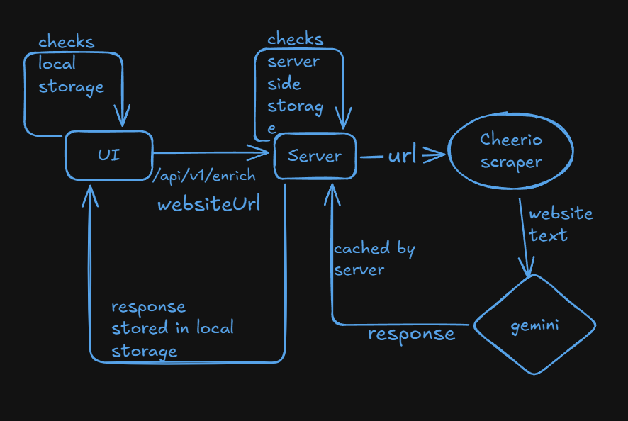

# VC Scout – Intelligence Interface + Live Enrichment

A functional VC discovery interface that enables venture teams to discover companies, view structured profiles, and run live AI-powered enrichment on public company websites.

This project implements a clean discovery workflow:
**discover → open profile → enrich → analyze → save insights**

Built as part of the VC Intelligence Interface + Live Enrichment intern assignment.

---

## 🚀 Live Demo

**Frontend (Deployed):**
<https://vc-ai-sourcing.vercel.app/>

**Backend API:**
<https://vc-ai-sourcing.onrender.com>

**GitHub Repo:**
<https://github.com/Ambrish5211/VC-AI-Sourcing>

---

## 🧠 Overview

VC firms spend significant time sourcing and triaging startups from fragmented tools.
This application converts that workflow into a unified intelligence interface with live enrichment.

The system allows users to:

* Search and filter companies quickly
* Open detailed company profiles
* Run AI-based enrichment on demand
* Cache enrichment results to reduce cost and latency
* Save notes and lists locally

The goal was to build a **real product-feel MVP** with proper engineering practices rather than a quick prototype.

---

## 🏗️ Architecture

### Tech Stack

**Frontend**

* React (Vite)
* Tailwind CSS
* Axios
* Fuse.js (fuzzy search)
* LocalStorage (notes, lists, enrichment cache)

**Backend**

* Node.js + Express
* Gemini API (LLM extraction)
* Axios + Cheerio (web scraping)
* In-memory cache with TTL

---

### High-Level Flow

```
User → React UI → Backend API → Scraper → Gemini LLM → Cache → Response → UI

```

1. User searches and discovers companies
2. Opens company profile
3. Clicks "Enrich"
4. Check localStorage for cached result
5. If not cached → call backend API -> backend checks in-memory cache -> if not cached → scrape   website + send to Gemini -> return structured insights -> cache in-memory and localStorage
6. Structured insights returned
7. Cached server-side and displayed in UI

---

## ✨ Features Implemented

### Companies Discovery

* Backend-driven search, filtering and pagination
* Fuzzy search using Fuse.js for fast discovery
* Sortable and paginated company table
* Clean responsive interface

### Company Profile

* Overview and metadata
* Notes (stored in localStorage)
* Save to list functionality
* Enrichment trigger button

### 🔥 Live AI Enrichment

On-demand enrichment from public company websites:

Extracted fields:

* Summary (1–2 lines)
* What they do (bullet points)
* Keywords
* Derived signals (hiring, blog, changelog etc.)
* Source URLs
* Timestamp

All enrichment executed server-side to keep API keys secure.

---

## ⚡ Caching Strategy (Engineering Focus)

### 1. Server-Side Cache (Primary)

Implemented using in-memory Map with TTL.

Purpose:

* Prevent repeated Gemini API calls
* Reduce latency
* Control cost

Flow:

```
Request → check cache → if hit return → else enrich → store → return
```

### 2. Client-Side Cache (UX Optimization)

Stored in localStorage per company website.

Purpose:

* Instant reload after refresh
* Avoid unnecessary repeated calls
* Improve UX responsiveness

Server cache remains source of truth.

> **Note:** Server cache is in-memory and resets if the backend instance restarts or sleeps (Render free tier behavior). Since this is an MVP, this is acceptable; production systems would use Redis or persistent caching.

---

## 🔍 Search Implementation

Search is implemented using **Fuse.js** for fast fuzzy matching.

Advantages:

* Handles typos and partial matches
* Lightweight and fast
* Improves discovery experience
* Works seamlessly with backend pagination

---

## 📦 API Endpoints

### GET /api/companies

Returns paginated and filtered companies.

Query params:

```
search
sector
stage
page
limit
sort
order
```

### GET /api/companies/:id

Returns single company profile.

### POST /api/enrich

Runs enrichment for company website.

Body:

```
{
  "websiteUrl": "https://company.com"
}
```

Returns structured enrichment JSON.

---


## 🛠️ Local Setup

### 1. Clone repository

```
git clone <repo-url>
cd vc-scout
```

---

### 2. Backend Setup

```
cd server
npm install
```

Create `.env`

```
GEMINI_API_KEY=your_key
PORT=5000
CORS_ORIGIN=http://localhost:5173
```

Run backend:

```
npm run dev
```

---

### 3. Frontend Setup

```
cd client
npm install
```

Create `.env`

```
VITE_API_URL=http://localhost:PORT/api/v1
```

Run frontend:

```
npm run dev
```

---

## 🚀 Deployment

Frontend deployed on Vercel.
Backend deployed on Render/Railway.

All API keys are stored securely in environment variables and never exposed to the browser.

---

## ⚖️ Tradeoffs & Future Improvements

Given the time constraint, the focus was on a clean, working MVP.

Possible improvements:

* Replace in-memory cache with Redis
* Add background enrichment queue
* Persistent database (MongoDB/Postgres)
* Vector search for similar companies
* Multi-source enrichment (GitHub, news, jobs)
* Auth + multi-user support
* Slack/CRM integrations

---

## 👨‍💻 Author

**Ambrish Kumar**

Happy to walk through architecture or design decisions if helpful.
